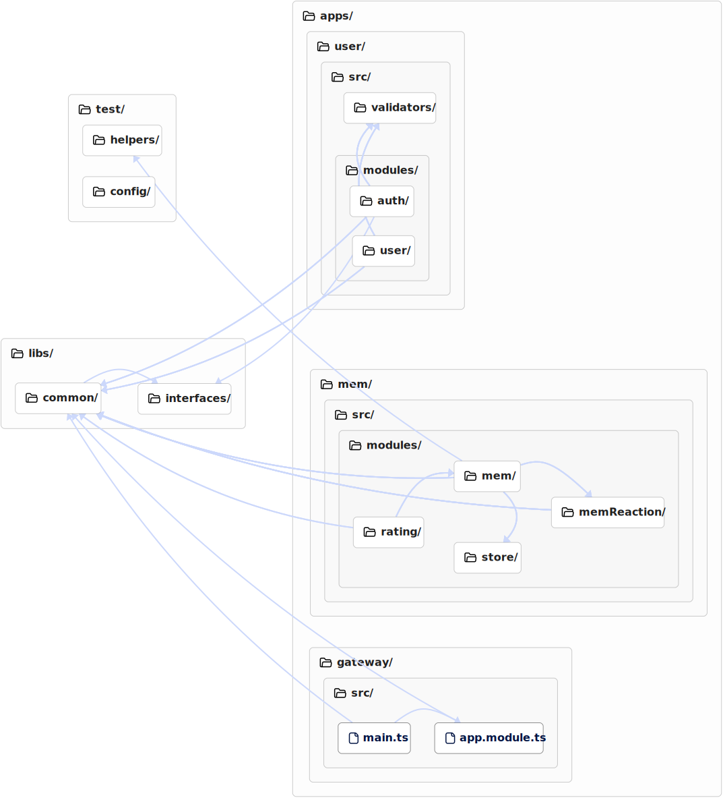

# MemHouse


MemHouse is a platform to easy surf mems

## Zen

- Platform is only for mems. No messages, no something else

- Users can subscribe only for tags, not for communities (Like in VK). Thus, we will avoid the problem if the community is overwhelmed with subscribers and because of this, a lot of people watch it memes, although the memes are of poor quality.

- Show only hith rating mems with not duplicates

- Users can creates mems and earn money for that (We are not greedy)

## Architecture


<https://drive.google.com/file/d/1uncUdHqMnCW973bLj6hlUAizCPfXi3_p/view?usp=sharing>

## Database


## Codesee



https://app.codesee.io/guide/a/eb4dae88-b787-427f-a97f-de582d98ccb0


### Use ngrok for apply connection to the client side in the Internet

```bash
/Users/user/Downloads/ngrok http 3002
```

## Build docker images

```bash
docker build -t user --build-arg APP_NAME=user .
docker build -t mem --build-arg APP_NAME=mem .
docker build -t gateway --build-arg APP_NAME=gateway .
```

## Start docker images

```bash
docker run --env-file ./.env user
docker run --env-file ./.env mem
docker run --env-file ./.env gateway
```
